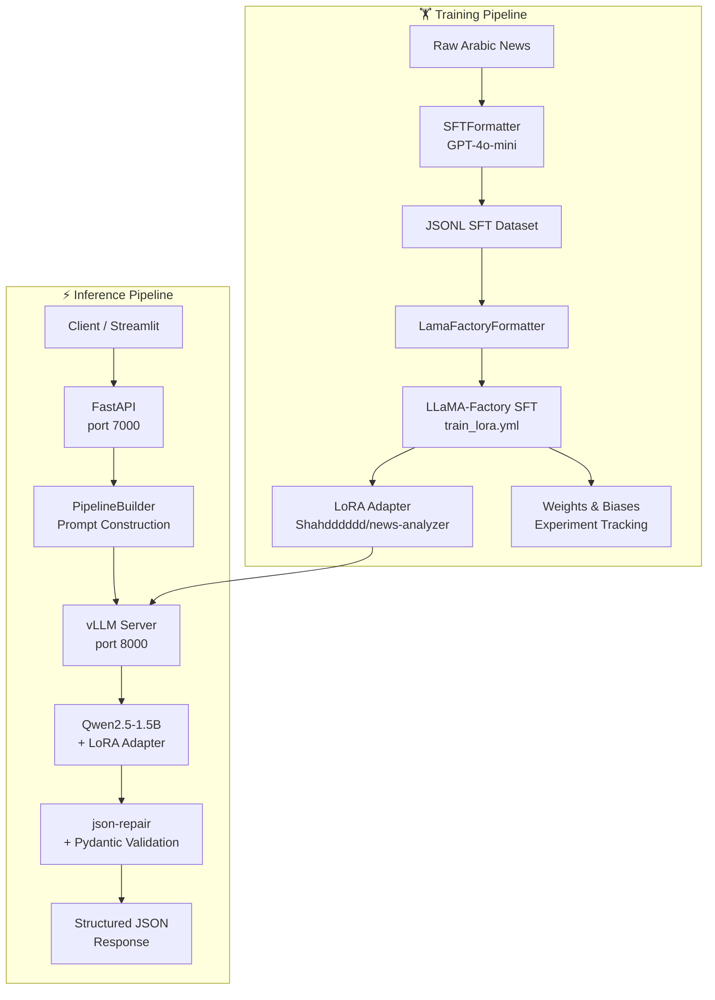

# 📰 Arabic News Analyzer

> A production-ready Arabic NLP system powered by a fine-tuned Qwen2.5-1.5B model — delivering structured news extraction and multilingual translation through a high-performance vLLM inference backend.

---

## Project Overview

Fine-tuning a **1.5B parameter language model** to achieve GPT-4-level performance on Arabic news NLP tasks — without GPT-4 inference costs.

This project implements a complete end-to-end pipeline that uses **GPT-4o-mini as a teacher model** to generate high-quality training data, then fine-tunes **Qwen2.5-1.5B-Instruct** using **LoRA** and **LLaMA-Factory**. The resulting model is deployed through **vLLM** for high-throughput inference and exposed through a **FastAPI backend** and **Streamlit dashboard**.

The system performs Arabic news information extraction and translation while remaining fully self-hosted and cost-efficient.

---
## Problem Statement

Arabic news NLP requires extracting structured information such as titles, keywords, summaries, named entities, and categories from unstructured text. While GPT-4o can perform these tasks with high accuracy, using it in production is expensive and cannot be fully self-hosted.

The solution was to use GPT-4o-mini once as a teacher model to generate high-quality labeled data, then fine-tune a lightweight **Qwen2.5-1.5B** model on that data. The result is a self-hosted model capable of producing GPT-4o-style structured outputs for Arabic news analysis at **zero per-request API cost**.


---

## Key Highlights

- 🧠 **Knowledge Distillation from GPT-4o-mini** — synthetic supervised fine-tuning data was generated using GPT-4o-mini, teaching the smaller student model task-specific behavior.
- 📦 **Custom Synthetic Dataset Generation** — a fully automated `SFTFormatter` pipeline queries GPT-4o-mini over raw news corpora to produce labeled training examples.
- 🔧 **LoRA Fine-tuning** — parameter-efficient fine-tuning with LoRA (rank 64) keeps the adapter small while achieving strong task performance.
- 🌍 **Arabic NLP Capabilities** — the model handles Arabic text natively, including extraction, categorization, NER, and translation.
- ⚡ **Fast Inference via vLLM** — the deployed model uses vLLM's OpenAI-compatible server with continuous batching and KV-cache optimization for ~25× throughput over standard Transformers inference.
- 🏭 **LLaMA-Factory Training Framework** — fine-tuning orchestrated using the LLaMA-Factory SFT pipeline with Qwen chat templates.
- 🚀 **Production-Ready API & UI** — FastAPI REST backend and an interactive Streamlit dashboard, both containerization-ready.

---

## Tech Stack

| Layer | Technology |
|---|---|
| **Language** | Python 3.10+ |
| **API Framework** | FastAPI |
| **Frontend** | Streamlit |
| **Inference Server** | vLLM |
| **Base Model** | Qwen/Qwen2.5-1.5B-Instruct |
| **Fine-tuning Framework** | LLaMA-Factory |
| **PEFT Method** | LoRA |
| **Data Generation** | OpenAI GPT-4o-mini |
| **LLM Client** | OpenAI Python SDK |
| **Schema Validation** | Pydantic v2 |
| **Experiment Tracking** | Weights & Biases |
| **Tokenizer** | Hugging Face Transformers |
| **JSON Repair** | json-repair |
| **Load Testing** | Locust |
| **Fake Data (Arabic)** | Faker (`ar` locale) |
| **Config Management** | python-dotenv |
| **HTTP Client** | Requests |
| **Containerization** | Docker (shell scripts included) |

---

## Architecture

### Overview

The system is composed of three independent pipelines:

### Training Pipeline

```
Raw Arabic News Corpus
        │
        ▼
SFTFormatter (GPT-4o-mini)
  → Queries GPT-4o-mini for each article
  → Validates JSON output against Pydantic schemas
  → Writes labeled JSONL to disk
        │
        ▼
LamaFactoryFormatter
  → Converts JSONL to LLaMA-Factory SFT format
  → Shuffles and splits train/val sets
        │
        ▼
LLaMA-Factory SFT (train_lora.yml)
  → Base model: Qwen/Qwen2.5-1.5B-Instruct
  → Fine-tuning method: LoRA (rank 64, target: all)
  → Tracks experiments → Weights & Biases
  → Pushes adapter → Hugging Face Hub (Shahdddddd/news-analyzer)
```

### Inference Pipeline

```
Client Request (story text)
        │
        ▼
FastAPI (main.py → routes.py)
  → PipelineBuilder: builds structured prompt
  → Calls vLLM OpenAI-compatible endpoint
        │
        ▼
vLLM Server (run_vllm.sh)
  → Base model: Qwen/Qwen2.5-1.5B-Instruct
  → LoRA adapter: Shahdddddd/news-analyzer
  → Continuous batching + KV cache
        │
        ▼
json-repair → Pydantic model validation
        │
        ▼
Structured JSON Response
```

### Deployment Pipeline

```
.env (API keys, URLs)
        │
   ┌────┴────────────────┐
   ▼                     ▼
vLLM Server          FastAPI Server
(port 8000)          (port 7000)
                         │
                         ▼
                  Streamlit Dashboard
                    (port 8501)
```

### Architecture Diagram



---

## Model Training

### Base Model

The project fine-tunes **[Qwen/Qwen2.5-1.5B-Instruct](https://huggingface.co/Qwen/Qwen2.5-1.5B-Instruct)**, a compact yet capable instruction-tuned language model well-suited for structured output generation.

### Fine-tuning Strategy

Training was performed using the **LLaMA-Factory** framework with supervised fine-tuning (SFT) and LoRA.

**LoRA Configuration:**

| Parameter | Value |
|---|---|
| `finetuning_type` | `lora` |
| `lora_rank` | `64` |
| `lora_target` | `all` |
| `max_lora_rank` (vLLM) | `64` |
| `learning_rate` | `1e-4` |
| `lr_scheduler_type` | `cosine` |
| `warmup_ratio` | `0.1` |
| `num_train_epochs` | `3` |
| `cutoff_len` | `3500` |
| `bf16` | `true` |
| `per_device_train_batch_size` | `1` |
| `gradient_accumulation_steps` | `4` |

### Dataset Preparation

The `SFTFormatter` class automates dataset construction:

1. Iterates over raw Arabic news articles.
2. Builds a structured prompt containing the article, task description, and Pydantic output schema.
3. Calls **GPT-4o-mini** to generate labeled JSON responses.
4. Validates the response against the schema and appends valid records to a JSONL file.
5. Tracks token consumption and API cost in real time.

The `LamaFactoryFormatter` then transforms these JSONL records into the LLaMA-Factory conversation format (system / instruction / output), ready to be referenced in `train_lora.yml` as the `news_finetune_train` dataset.

### Knowledge Distillation

> This project uses GPT-4o-mini to generate high-quality supervised training data, enabling the smaller model to learn task-specific behavior through knowledge distillation. Rather than relying on expensive manual annotation, GPT-4o-mini acts as the teacher, and the fine-tuned Qwen2.5-1.5B model acts as the student — learning to produce structured NLP outputs directly from the teacher's demonstrations.

---

## Experiment Tracking

All training runs are tracked using **Weights & Biases**, with loss curves, evaluation metrics, and hyperparameter configurations logged automatically via LLaMA-Factory's `report_to: wandb` integration.

🔗 [View the W&B Workspace](https://wandb.ai/shahdabdelmaqsoud81-ain-shams-university/llamafactory/workspace?nw=nwusershahdabdelmaqsoud81)

---

## Inference Optimization

The model is served using **[vLLM](https://github.com/vllm-project/vllm)**, a high-throughput inference engine for LLMs.

> vLLM improved generation throughput by approximately 25× compared to standard Transformers inference.

Key optimizations enabled:

**Continuous Batching** — vLLM dynamically groups incoming requests at the token level, eliminating the idle GPU time seen in static batching.

**KV Cache Optimization** — PagedAttention manages the key-value cache in non-contiguous memory blocks, dramatically reducing memory waste and allowing more concurrent requests.

**OpenAI-Compatible API** — the vLLM server exposes an `/v1/chat/completions` endpoint that is fully compatible with the OpenAI Python SDK, making it a drop-in replacement. The `PipelineBuilder` in `inference.py` connects to it transparently.

**LoRA Adapter Support** — the server loads the base model once and dynamically applies the `news-analyzer` LoRA adapter at request time, avoiding the need to merge weights.

---

## Features

- 📰 **Arabic News Information Extraction** — extracts title, category, keywords, bullet-point summary, and named entities from Arabic news articles.
- 🌍 **News Translation** — translates Arabic news stories into English or French with a structured title and full-content output.
- 🏷️ **Named Entity Recognition** — identifies entities of types: person (male/female), location, organization, event, time, quantity, money, product, law, disease, and artifact.
- 📂 **News Categorization** — classifies stories into: politics, sports, art, technology, economy, health, entertainment, or science.
- 🗂️ **Structured JSON Generation** — all outputs are validated against strict Pydantic v2 schemas with automatic JSON repair via `json-repair`.
- 🔌 **REST API** — production-ready FastAPI backend with health check, extraction, and translation endpoints.
- 📊 **Streamlit Dashboard** — interactive UI with live API status, generation controls, token-limit validation, downloadable results, and session history.
- ⚡ **Fast Inference** — vLLM backend with continuous batching and KV-cache optimization.
- 🔧 **LoRA Adapter Support** — the vLLM server dynamically loads the fine-tuned LoRA adapter alongside the base model.
- 🧪 **Load Testing** — Locust-based load test suite simulating concurrent Arabic news extraction requests.

---

## API Endpoints

| Endpoint | Method | Description |
|---|---|---|
| `/health` | `GET` | Returns API name, version, and health status. |
| `/extract-details` | `POST` | Extracts structured details (title, category, keywords, summary, entities) from an Arabic news story. Returns a `NewsDetails` JSON object. |
| `/translate-story` | `POST` | Translates an Arabic news story into English or French. Returns a `TranslatedStory` JSON object with translated title and content. |

### Request Schemas

**`POST /extract-details`**
```json
{
  "story": "Arabic news article text...",
  "temperature": 0.2,
  "max_tokens": 1000
}
```

**`POST /translate-story`**
```json
{
  "story": "Arabic news article text...",
  "target_lang": "English",
  "temperature": 0.2,
  "max_tokens": 1000
}
```

### Response Schema — `NewsDetails`

```json
{
  "story_title": "...",
  "story_keywords": ["...", "..."],
  "story_summary": ["Point 1", "Point 2"],
  "story_category": "politics",
  "story_entities": [
    { "entity_value": "...", "entity_type": "person-male" }
  ]
}
```

### Response Schema — `TranslatedStory`

```json
{
  "translated_title": "...",
  "translated_content": "..."
}
```

---

## Frontend

The Streamlit dashboard (`app/frontend/streamlit_app.py`) provides a browser-based interface with three tabs:

**📊 News Extraction Tab**
- Text area for pasting an Arabic news story.
- Real-time token counting against the model's 4,000-token context limit (story tokens + max output tokens).
- Displays extracted title, category, keywords, bullet-point summary, and named entities with type badges.
- One-click JSON download of the full extraction result.

**🌍 Translation Tab**
- Text area for the story input with a language selector (English / French).
- Displays the translated title and full translated content.
- One-click JSON download of the translation result.

**🕓 History Tab**
- Scrollable log of all requests made in the current session.
- Each entry shows the task type, latency, and the full JSON result in an expandable viewer.

**Sidebar** provides live API health status, adjustable temperature and max-tokens sliders, and running session statistics (total requests, average latency).

---

## Testing

### Load Testing with Locust

The project includes a Locust load test in `app/tests/locustfile.py` that simulates concurrent users sending random Arabic extraction requests.

```bash
# Install Locust
pip install locust

# Run the load test (API must be running on localhost:7000)
locust -f app/tests/locustfile.py --host=http://localhost:7000
```

Open `http://localhost:8089` in your browser to configure and launch the swarm.

### Manual API Testing

```bash
# Health check
curl http://localhost:7000/health

# Extract news details
curl -X POST http://localhost:7000/extract-details \
  -H "Content-Type: application/json" \
  -d '{"story": "أعلنت الحكومة عن خطة اقتصادية جديدة...", "temperature": 0.2, "max_tokens": 1000}'

# Translate a story
curl -X POST http://localhost:7000/translate-story \
  -H "Content-Type: application/json" \
  -d '{"story": "أعلنت الحكومة...", "target_lang": "English", "temperature": 0.2, "max_tokens": 1000}'
```

### FastAPI Interactive Docs

Once the API is running, visit:

```
http://localhost:7000/docs
```

---

## Folder Structure

```
.
├── main.py                          # FastAPI application entry point
├── run_vllm.sh                      # vLLM server launch script
├── .env                             # Environment variables (not committed)
│
├── app/
│   ├── api/
│   │   ├── inference.py             # PipelineBuilder: prompt construction & vLLM calls
│   │   └── routes.py                # FastAPI route definitions
│   │
│   ├── frontend/
│   │   ├── streamlit_app.py         # Streamlit dashboard (3 tabs)
│   │   └── api_helper.py            # HTTP client functions for the Streamlit app
│   │
│   ├── helper/
│   │   └── config.py                # Environment config & model IDs
│   │
│   ├── schemas/
│   │   ├── news_schemas.py          # NewsDetails & Entity Pydantic models
│   │   ├── translation_schemas.py   # TranslatedStory Pydantic model
│   │   └── request_schemas.py       # ExtractionRequest & TranslationRequest models
│   │
│   ├── tests/
│   │   └── locustfile.py            # Locust load test for /extract-details
│   │
│   └── utils/
│       └── prompts.py               # Shared system message prompt
│
└── finetuning/
    ├── train_lora.yml               # LLaMA-Factory SFT + LoRA training config
    └── dataformater/
        ├── SFTFormater.py           # Generates SFT data via GPT-4o-mini
        └── LamaFactoryFormater.py   # Converts JSONL to LLaMA-Factory format
```

---

## Installation

### Prerequisites

- Python 3.10+
- CUDA-compatible GPU (for vLLM)
- A Hugging Face account with access to `Shahdddddd/news-analyzer`
- An OpenAI API key (for dataset generation only)

### 1. Clone the Repository

```bash
git clone https://github.com/<your-username>/arabic-news-analyzer.git
cd arabic-news-analyzer
```

### 2. Create a Virtual Environment

```bash
python -m venv venv
source venv/bin/activate   # Windows: venv\Scripts\activate
```

### 3. Install Dependencies

```bash
pip install fastapi uvicorn streamlit vllm \
            openai transformers pydantic \
            python-dotenv requests json-repair \
            locust faker
```

### 4. Configure Environment Variables

Create a `.env` file in the project root:

```env
APP_NAME=Arabic News Analyzer
APP_VERSION=1.0.0
VLLM_URL=http://localhost:8000/v1
open-ai-key=sk-...        # Only needed for dataset generation
```

---

## Running the Project

### Start vLLM

```bash
bash run_vllm.sh
```

This launches the vLLM OpenAI-compatible server on port `8000` with the Qwen2.5-1.5B base model and the `news-analyzer` LoRA adapter loaded dynamically.

```bash
# run_vllm.sh contents (for reference):
python -m vllm.entrypoints.openai.api_server \
  --model Qwen/Qwen2.5-1.5B-Instruct \
  --enable-lora \
  --lora-modules news-analyzer=Shahdddddd/news-analyzer \
  --host 0.0.0.0 \
  --port 8000 \
  --dtype float16 \
  --quantization bitsandbytes \
  --gpu-memory-utilization 0.8 \
  --max-model-len 4000 \
  --max-lora-rank 64 \
  --enforce-eager \
  --max-cpu-loras 1
```
or
```bash
chmod +x run_vllm.sh
./run_vllm.sh
```

### Start FastAPI

```bash
uvicorn main:app --host 0.0.0.0 --port 7000 --reload
```

### Start Streamlit

```bash
streamlit run app/frontend/streamlit_app.py
```

The dashboard will be available at `http://localhost:8501`.

---

## Example Usage

### Extract Details from an Arabic News Story

**Request:**
```bash
curl -X POST http://localhost:7000/extract-details \
  -H "Content-Type: application/json" \
  -d '{
    "story": "أعلنت وزارة الصحة المصرية عن اكتشاف لقاح جديد لمرض السرطان بالتعاون مع جامعة القاهرة، في خطوة وصفها الخبراء بأنها نقلة نوعية في تاريخ الطب.",
    "temperature": 0.2,
    "max_tokens": 1000
  }'
```

**Response:**
```json
{
  "story_title": "وزارة الصحة المصرية تعلن اكتشاف لقاح جديد لمرض السرطان بالتعاون مع جامعة القاهرة",
  "story_keywords": ["لقاح", "سرطان", "وزارة الصحة", "جامعة القاهرة", "طب"],
  "story_summary": [
    "أعلنت وزارة الصحة المصرية عن اكتشاف لقاح جديد لمرض السرطان.",
    "جاء الاكتشاف بالتعاون مع جامعة القاهرة.",
    "وصف الخبراء الاكتشاف بأنه نقلة نوعية في تاريخ الطب."
  ],
  "story_category": "health",
  "story_entities": [
    { "entity_value": "وزارة الصحة المصرية", "entity_type": "organization" },
    { "entity_value": "جامعة القاهرة", "entity_type": "organization" },
    { "entity_value": "السرطان", "entity_type": "disease" }
  ]
}
```

---

## Future Improvements

- **Multi-language input support** — extend extraction to support non-Arabic sources (e.g., English or French input stories).
- **Streaming responses** — leverage vLLM's streaming API and expose server-sent events through FastAPI for lower perceived latency in the UI.
- **Batch inference endpoint** — add a `/batch-extract` endpoint for processing multiple stories in a single request.
- **Confidence scores** — attach model-level confidence estimates to extracted entities and categories.
- **Docker Compose** — provide a `docker-compose.yml` to spin up the full stack (vLLM + FastAPI + Streamlit) with a single command.
- **Larger base model** — evaluate performance gains from fine-tuning Qwen2.5-7B-Instruct or a similarly sized multilingual model.
- **Active learning loop** — use low-confidence or malformed model outputs to automatically queue new GPT-4o-mini labeling jobs, expanding the training set continuously.
- **Authentication** — add API key middleware to the FastAPI layer for production deployments.

---


